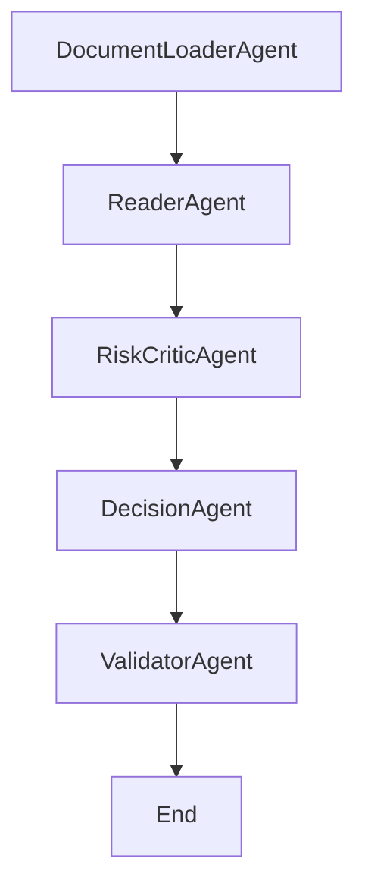

# Multi-Agent Agentic AI Document Processing System

## Overview

This project implements a **multi-agent AI system** for analyzing organizational documents (e.g., legal, policy, compliance files) using **LangChain**, **LangGraph**, and **OpenAI's GPT-4o**. The system orchestrates a series of **autonomous agents** that read a document, assess potential risks, recommend actions, and validate those decisions in a structured workflow.

---

## Architecture

The system follows a **multi-agent graph-based architecture**, where each agent performs a specialized task on the document data:

### Agent Workflow (Graph Nodes)

### Agent Roles

1. **Reader Agent**
   - Reads the uploaded `.pdf`, `.docx`, or `.txt` document.
   - Extracts and structures the textual content.
   - Handles file parsing errors gracefully.

2. **Risk Critic Agent**
   - Identifies **legal, compliance, financial, or operational risks**.
   - Flags ambiguous clauses, liabilities, or regulatory issues.
   - Categorizes risks with severity levels (Low / Medium / High).

3. **Decision Agent**
   - Synthesizes extracted information and risk analysis.
   - Provides **actionable recommendations** (Accept / Revise / Flag).
   - Justifies each recommendation based on priorities and compliance.

4. **Validator Agent**
   - Critically reviews Decision Agent's outputs.
   - Validates or challenges recommendations.
   - Offers alternate suggestions if needed.

---

## Technologies Used

- **LangChain**: Agent framework and prompt chaining.
- **LangGraph**: Graph orchestration of agent workflows.
- **LangChain OpenAI**: Access to GPT-4o via `ChatOpenAI`.
- **Unstructured** and **PyMuPDF**: Document loaders for parsing DOCX, PDF, and TXT files.
- **Pydantic**, `TypedDict`, `Annotated`: Strong typing for agent state structure.
- **Google Colab compatible**: Interactive and visual flow representation.

---

##  Assumptions

- The document must be one of the supported formats: `.pdf`, `.docx`, or `.txt`.
- Input is assumed to be readable and structurally meaningful (e.g., legal contracts, agreements).
- GPT-4o is assumed to have access to sufficient context length to handle full documents or representative chunks.

---

## Limitations

- **Not a substitute for human legal review**: The AI agents provide analysis based on language modeling and may miss contextual, jurisdictional, or intent-based nuances.
- **File size & structure sensitivity**: Very large or poorly structured documents may yield suboptimal parsing or LLM responses.
- **Reliance on OpenAI API**: Requires valid API key and internet connectivity to invoke GPT-4o.

---

## Author

**Rakesh Adhikari**  
